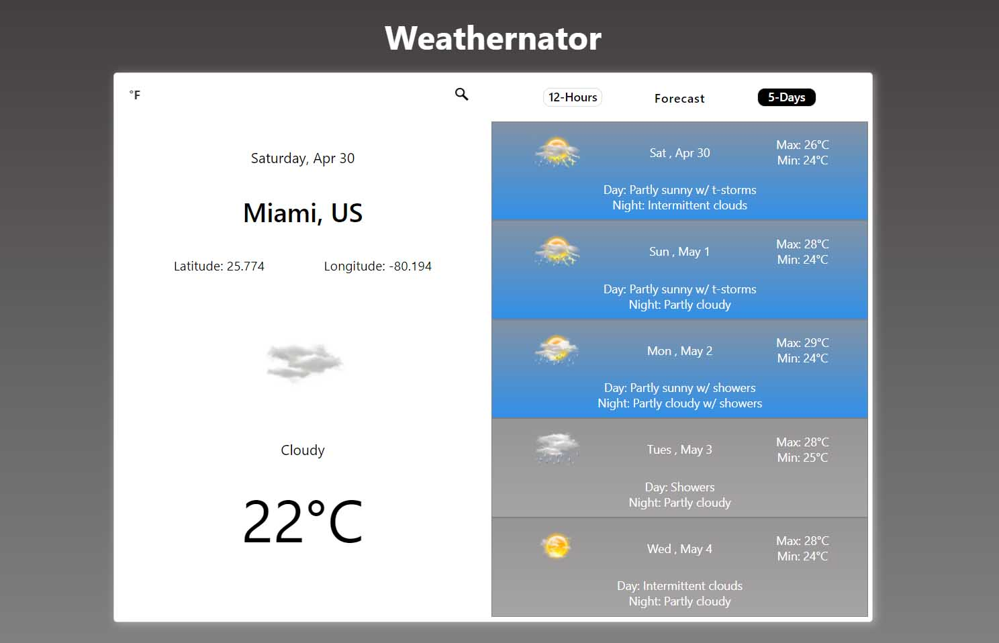

## Weather App aka 'The Weathernator'

This was created to satisfy my curiousity about how other weather apps worked and from where they imported the data. I found out that the weather information was retrieved from a server with the use of an API and key to allow access. During this process, I learned about working with asynchronous functions to retrieve data which was in JSON format and how to convert it into an object to populate my application. The initial goal was to make a current condition application, but there was so much more data available, so it expanded into a full blown weather application. 

### Project Tools
  - Visual Studio Code
  - Accuweather API (free version)
  - HTML5
  - CSS3
  - JavaScript ES6
  - Photoshop CC 2019
